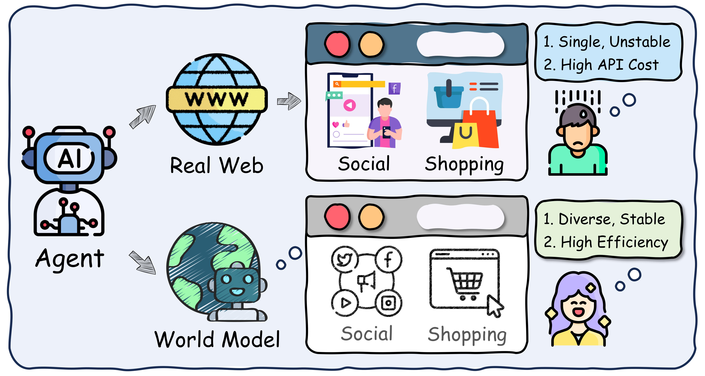
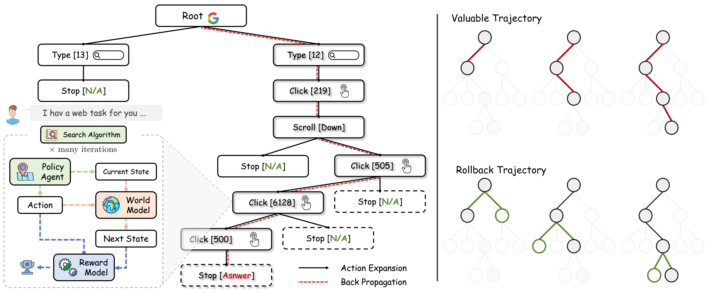
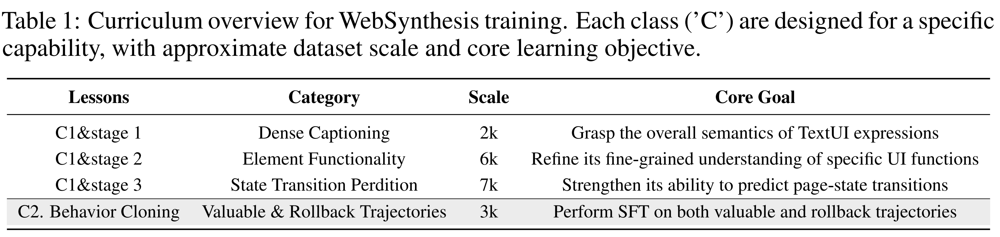
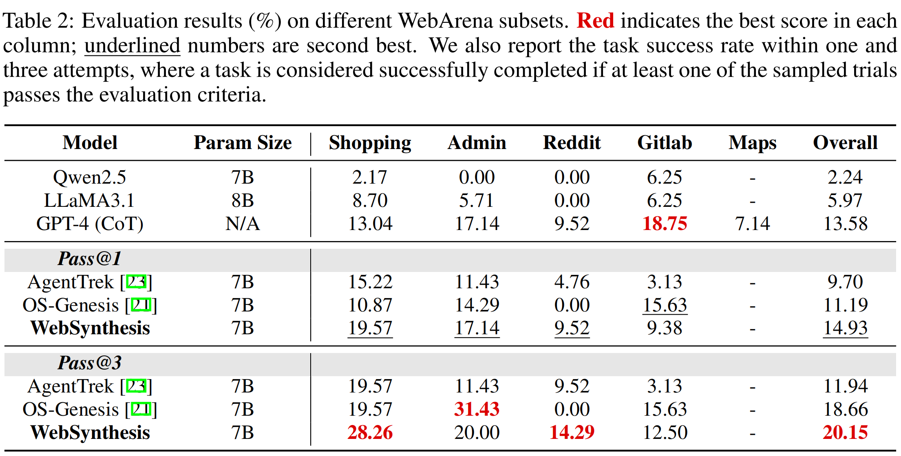
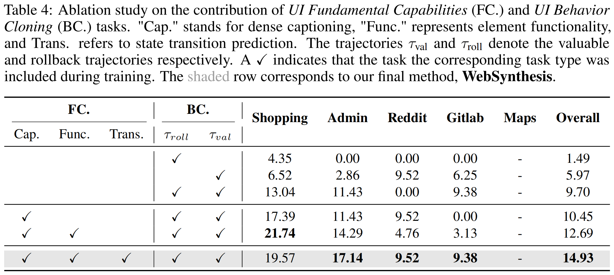
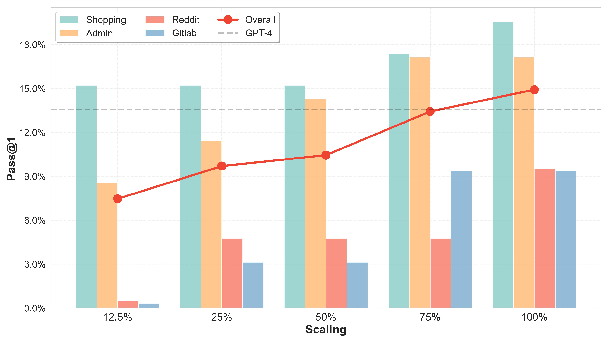

# WebSynthesis



<div style='display:flex; gap: 0.25rem; '>
<a href="https://www.arxiv.org/abs/2507.04370"></a>
<a href="https://huggingface.co/datasets/yifeigao/WebSynthesis"></a>
<a href='LICENSE'></a>
</div>

## World Model-Guided MCTS for Efficient WebUI-Trajectory Synthesis
WebSynthesis is a framework integrating **world model** learning and **Monte Carlo Tree Search** (MCTS), designed to significantly reduce the cost of online synthesis of high-quality Web UI trajectories. Through a two-stage curriculum, including UI fundamental understanding and UI behavior cloning, the policy agent acquires web navigation capabilities.



## News
* [08/07/2025] Our Paper is now available in [Arxiv](https://www.arxiv.org/abs/2507.04370).
* [07/07/2025] We upload some of the training data and LoRA weights.
* [06/07/2025] We release the code of WebSynthesis.


## Two-stage Curriculum Learning


## Data Collection (MCTS)

1. **Clone the GitHub Repository:**
   ```
   git clone https://github.com/LucusFigoGao/WebSynthesis.git
   ```

2. **Collection:**
   ```bash
   cd WebMCTS
   bash run.sh          # run MCTS
   pyhton merge.py      # merge the data
   ```

## Data Resources 

### UI Fundamental Understanding

|   Model Name    |                           Base Model                                            |                           Training Data                                            |                           LoRA                            |
| :-------------: | :-------------------------------------------------------------------------------------: | :----------------------------------------------------------------------------: | :---------------------------------------------------------: |
| TextUI-Cap-7B | [Qwen2.5-Instruct-7B](https://huggingface.co/Qwen/Qwen2.5-7B-Instruct)            | [TextUI-dense-caption-training-data](https://huggingface.co/datasets/yifeigao/WebSynthesis/blob/main/textui-caption2k.json) | [🤗 link](https://huggingface.co/yifeigao/WebSynthesis/tree/main/TextUI-Cap-7B)  |
| TextUI-Func-7B | [Qwen2.5-Instruct-7B](https://huggingface.co/Qwen/Qwen2.5-7B-Instruct) | [TextUI-functionality-training-data](https://huggingface.co/datasets/yifeigao/WebSynthesis/blob/main/textui-function6k.json) | [🤗 link](https://huggingface.co/yifeigao/WebSynthesis/tree/main/TextUI-Func-7B)  |
| TextUI-Trans-7B | [Qwen2.5-Instruct-7B](https://huggingface.co/Qwen/Qwen2.5-7B-Instruct)            | [TextUI-state-transition-training-data](https://huggingface.co/datasets/yifeigao/WebSynthesis/blob/main/textui-transmission7k.json) | [🤗 link](https://huggingface.co/yifeigao/WebSynthesis/tree/main/TextUI-Trans-7B)  |

### UI Behavior Cloning
|   Model Name    |                           Base Model                                            |                           Training Data                                            |                           LoRA                            |
| :-------------: | :-------------------------------------------------------------------------------------: | :----------------------------------------------------------------------------: | :---------------------------------------------------------: |
| WebSynthesis-7B | [Qwen2.5-Instruct-7B](https://huggingface.co/Qwen/Qwen2.5-7B-Instruct)            | [WebSynthesis-training-data](https://huggingface.co/datasets/yifeigao/WebSynthesis/tree/main/websynthesis.json) | [🤗 coming soon](https://huggingface.co/yifeigao/WebSynthesis)  |
| OS-Genesis-TextUI-7B | [Qwen2.5-Instruct-7B](https://huggingface.co/Qwen/Qwen2.5-7B-Instruct) | [OS-Genesis-training-data](https://huggingface.co/datasets/yifeigao/WebSynthesis/tree/main/os_genesis_sft7k.json) | [🤗 coming soon](https://huggingface.co/yifeigao/WebSynthesis)  |

### Collection of World Model State Transition
|   Model Name    |                           Base Model                                            |                           Training Data                                            |                           LoRA                            |
| :-------------: | :-------------------------------------------------------------------------------------: | :----------------------------------------------------------------------------: | :---------------------------------------------------------: |
| World Model 7B | [Qwen2.5-Instruct-7B](https://huggingface.co/Qwen/Qwen2.5-7B-Instruct)            | [world-model-training-data](https://huggingface.co/datasets/yifeigao/WebSynthesis/blob/main/world-model-training-data-27k.json) | [🤗 coming soon](https://huggingface.co/yifeigao/WebSynthesis/)  |

🙏 Many thanks to the following open-source projects for their raw data contributions:
- [ICLR'25] [OS-Genesis-Web-Data](https://huggingface.co/datasets/OS-Copilot/OS-Genesis-web-data)
- [ACL'25] [AgentTrek-Web-Data](https://huggingface.co/datasets/xlangai/AgentTrek)
- [ICLR'24] [WebArena-Web-Data](https://github.com/web-arena-x/webarena/tree/main/resources)

## Main Experiment


## Ablation Studies


## Scaling Analysis


## Citation 📖

🫶 If you are interested in our work or find this repository / our data helpful, please consider using the following citation format when referencing our paper:

```bibtex
@misc{gao2025websynthesisworldmodelguidedmctsefficient,
   title={WebSynthesis: World-Model-Guided MCTS for Efficient WebUI-Trajectory Synthesis}, 
   author={Yifei Gao and Junhong Ye and Jiaqi Wang and Jitao Sang},
   year={2025},
   eprint={2507.04370},
   archivePrefix={arXiv},
   primaryClass={cs.AI},
   url={https://arxiv.org/abs/2507.04370}, 
}
```
